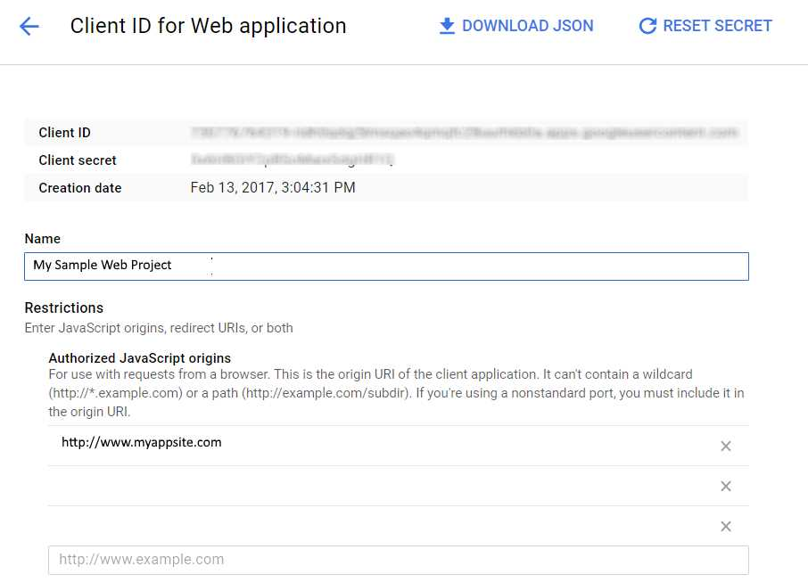
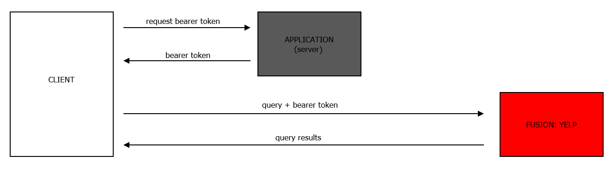

# Yelp Fusion API: A Front-End Approach
&nbsp;  

## Background

For those not in the know, Yelp is that wonderful and ubiquitous crowd-sourced  
reviews business which helps users gauge various qualitative (and quantitative)  
aspects of a business.  A common use would be as a reference for restaurants  
with quality and price ratings and, sometimes, pictures.  

As of April 2017, Yelp has been requiring developers to switch to using their  
latest (v3) API: **Yelp Fusion**, having sunset their v2 version.  I have not had  
any experience with earlier versions of the Yelp APIs but I can say that Fusion  
is very developer friendly as it sports a robust JSON RESTful API capable of  
executing various detailed searches while supporting autocomplete and lat-lng  
coordinates, which integrate very nicely with downstream applications that use  
these such as Google Maps.  See [here](https://www.yelp.com/developers/documentation/v3) for documentation.  

One of the features which sets Fusion apart from the v2 API is the use of  
OAuth 2.0.  As a result, a basic working feature of the new Fusion API is that  
developers must register their application in exchange for which they will get  
a client id and client secret.  

The combination of the client id and secret, in turn, may be used to obtain  
a bearer authorization token from Yelp. Any calls made to Fusion must be  
accompanied by this bearer token for the query to be valid/authenticated by  
Yelp.  Yelp describes this very neatly in its helpful [documentation](https://www.yelp.com/developers/documentation/v3/get_started).

Once issued, bearer authorization tokens are valid for 180 days (at the time of  
this writing); thus, there is no need to repeatedly request bearer tokens from  
Yelp within this time period as they may simply be re-used each time a query is  
sent to Fusion.  That said, it appears a seamless protocol to handle expired/expiring    
bearer tokens has yet to be developed (see: [here](https://github.com/Yelp/yelp-fusion/issues/84)).

Since the current Fusion set up is as follows:

```
client id + client secret = bearer token
```

the security considerations for the client id and secret should be obvious -  
they should be kept secret and never exposed.

Perhaps as a result of this, the Fusion API ***appears to have been developed  
with the intention for back-end use*** as there is no current "approved" method  
of using fusion via JavaScript.  Accordingly, Ajax requests from the front-end  
result in CORS issues, as neither CORS headers nor the JSONP workarounds are  
supported by Fusion (at least not at the time of this writing).  
&nbsp;  

## Why does this matter?

This matters because while the Yelp Fusion API works just fine as a  
back-end API (and the folks at Yelp and their collaborators have done a  
fantastic job of providing numerous code samples for these in all flavors  
of languages, see: [here](https://github.com/Yelp/yelp-fusion/tree/master/fusion)) the apparent incongruence of a back-end API  
for what is essentially meant to be a front-end use-case begs the question:  
Why can't a client-side request be made to Fusion for data that will  
(very likely) end up being rendered in the browser?  

As things are currently set up, Fusion's intended use works as follows:  


where the application interfacing with Fusion in the back-end acts as an  
intermediary.  Contrast this with the following possible scenario with  
no intermediary:  


It's possible that during the dev and testing phase, the difference in overhead    
between these two approaches is small enough to be barely noticeable.  

In the real world, however, I'm constantly reminded of what mere milliseconds  
cost during [browsing behavior](http://blog.gigaspaces.com/amazon-found-every-100ms-of-latency-cost-them-1-in-sales/) which would be part and parcel of the current  
approach.  

Furthermore, it makes logistical/operational sense to adopt the approach with  
no intermediary in which requests are made directly from the front-end to Yelp  
and returned back to the client since nearly 100% of the time this data is  
meant to be rendered in the browser.  Of course, this last "statistic" is a  
conjecture of mine - perhaps it's only 80 or 90% of the time - I don't know,  
but I'm willing to bet it's pretty high.  

Unfortunately, Fusion's intended use as things now stand does not make this  
possible.  
&nbsp;  

## The Challenge

Given the workings of OAuth2.0, it makes sense to store client credentials  
server-side, in keeping with the back-end orientation described above.  However,  
it would appear that exposure of the bearer token itself *also* carries a  
security risk (or at least a potentially disruptive impact) as anyone could use  
the valid bearer token to make requests against the API, which would work  
against the quota of the original owner/application.  

This is because use of the authorization token with Fusion may be summarized  
by the following relationship:

```
bearer token = permission to use API
```

This is in contrast with other vendors/entities who use OAuth2.0.  

Google, for instance, which uses OAuth2.0 for all its APIs, enforces an  
authorized origin such that the authorization code (in Google parlance)  
must be matched with the origin from which it emanates to be permissioned  
to use a given Google API.  In other words:

```
API key + authorized origin (originating domain for request) = permission to use API
```

The list of authorized origins is something which can be edited in the  
developer's Google API dashboard.  Here is a snapshot of one with salient  
details blurred out:  



By matching up an authorization code with an authorized JavaScript origin in  
this way, Google prevents *unauthorized* access to APIs from the likes of  
someone who might have stolen the authorization code for an API but who  
nonetheless would be attempting to access the Google API from an unregistered  
origin, thus rendering the stolen token useless.  

*If not enforcing such a check, as is the current set-up with Fusion, then  
exposure of the bearer-token presents the usage vulnerability described.*  

(Note that Google APIs also support development and testing - thus one can  
specify 'localhost' and a given port number as an authorized JavaScript origin  
as opposed to a live domain).  
&nbsp;  

## A possible workaround

I took it upon myself to adapt a front-end approach (via JavaScript and/or  
jQuery) to querying Yelp Fusion.  Recall that in order for any valid requests  
to be sent to Fusion, an authorized bearer token must accompany the request.  
Any front-end exposure of the token, either via cookies or local storage,  
exposes the bearer token and thus the app owner to the vulnerability described  
above.  

While [JavaScript encryption methods](https://github.com/bitwiseshiftleft/sjcl) do exist, these appear intended to  
encrypt information client-side but to allow for decryption server-side.  Since  
this involves crossing over to the server-side of things, this defeats our  
purpose.

Methods to mitigate this, from a purely front-end perspective, yield what I  
deem to be sub-optimal results.  For instance, it occured to me to salt the  
bearer token server-side and set as a cookie client-side with JavaScript making  
a request for the salt from my application upon loading.  

The idea was that once in the browser, the salted bearer token cookie would be  
unusable but that my JavaScript, knowing the salt, could cleanse/unsalt the cookie  
to get the 'clean' bearer token when sending requests to Fusion.  

Of course, the issue of persistence rises here.  Sure, I can get that salt  
into a JavaScript memory space upon loading but once that script is run, it's  
gone.  Now the question arises as to how to hold on to that salt value without  
storing as a cookie or in local storage.  Further, since the stack/associated  
scripts is visible client-side - not to mention the local storage and cookie  
itself - this would expose both the salt and cleansing technique, thus  
rendering this approach pretty much useless.  

In fact, (as I'm sure is obvious) this would merely reduce to the same  
vulnerability as the original exposure of the bearer-token via a cookie  
in the browser in the first place.  At best, it would make things *more  
inconvenient* for someone client-side to: copy the bearer token, retrieve  
the salt, cleanse the token and subsequently use it (as opposed to merely  
copying the bearer-token from a cookie or local storage).  

Of course, if you're willing to cut corners and merely make it ***inconvenient***  
for someone to steal/use the bearer token, this is one way of doing it.

The following approaches are better workarounds to this approach but are  
nevertheless vulnerable, albeit in a smaller way:

1).  At the start of a given session, have the application request the bearer  
token from Yelp and retain this value in memory.  The application would then  
serve the token to JavaScript requests which could then go directly to Yelp  
with data coming directly back to the client.

2). At the start of a given session, set the salted bearer token as a cookie  
in the browser.  Serve the salt to a JavaScript request which would then  
cleanse the bearer token before sending a query to Yelp.  One problem here is  
that while a randomly generated salt is likely to change from one session to  
another, the token doesn't.  Thus, "diffing" a salted bearer token between  
two sessions would simply reveal the token itself, in all its naked glory.  

3). Yet another variant could be for a JavaScript request for both the  
salted token and the salt from the server with the script doing the cleansing  
client-side.  Reading the script in the stack would reveal how to get to  
the underlying token, but at least our potential thief would have to sniff  
out both pieces of data being transmitted and then emulate the approach in the    
script to reveal the token (and we would be happy knowing that at least they  
had to work for it).

I repeat that none of these approaches is foolproof.  Furthermore, none of  
these addresses the vulnerability of exposing our bearer token during  
transmission of our query from the front-end to Yelp in the first place.  
However, in the trade-off for operational efficiency, it might be worth it  
(in the end, it's a judgement call).  

In the grand scheme of things, keep in mind our scope here is to  
mitigate issues with a *potentially* stolen authorization token, **not client id  
and secrets**.  Stolen tokens could mean quota usage being eaten up, but this does  
not amount to compromising the user account which should ultimately exercise  
any/all validity over authorization tokens.  

Again, all of this could be negated if Yelp were to enforce a combination of  
bearer token + authorized origin for API access rather than bearer token alone.  
If it did, an application could retrieve the bearer token upon loading and  
store it fully exposed in a cookie without worry of anyone using the bearer  
token to make queries against the owner's quota as they would necessarily be  
doing this from a non-authorized origin, thus failing at Yelp's end.  
&nbsp;  

## Going for it

If you're like me and believe it might be worth it to issue Fusion API requests  
from the client, you might agree that option #3 above would be worth a try.  
While it's true this involves some client/server crossover (and thus overhead)  
at least it's not as much as with the default back-end to back-end setup.  

Thus, the idea is to emulate an approach as follows:




*(Note: we'll request salt and salted tokens per #3 above as it's more 'fun'  
but it should be clear the fundamental approach is the same as querying for  
the token itself from our application).*  
&nbsp;  

### But what about CORS?

What about CORS, you say?  Valid question.  Even if we *do* end up getting this  
up and running, we'll ultimately be making requests from one domain to another,  
thus giving rise to the cross-origin resource sharing violation request.  

Recall that traditional workarounds to such access violations have included  
activating a CORS request by setting the request header appropriately and/or  
using JSONP to wrap our query.  However, as neither of these methods are  
supported by Fusion, we're out of luck on this front.  

That said, we *do* have at our disposal a tool which allows us to emulate a  
proxy server request, supporting a CORS header in the process, thereby allowing  
us to complete our query as though it were 'server-side', bypassing the CORS  
violation.  This works by simply prepending the indicated URL to our target URL  
and voila - we get to serve a request with raising any CORS violations.  
You can read more about this [here](https://www.npmjs.com/package/cors-anywhere).
&nbsp;  

## Putting it all together: querying Fusion from the front-end

Okay, it's action time.  Let's put together our key ideas from the preceding  
commentary and see what we can do.  To recap, we are going to:

1). Have our back-end application (in this case Python) request our bearer  
token from Yelp using our client credentials.  Our application will then  
generate a random salt and salt the token and pass both to our JavaScript query  
when requested.  

2). When the user initiates a Yelp query from the browser, we will send an ajax  
request to our application which will return the salted token and its salt and  
use JavaScript to cleanse the salted token.  This way, we have two mysterious  
bits of data coming into the browser, but only briefly - avoiding long periods  
of exposure as would be the case if stored plain-text in a cookie.  *Remember  
this is still a vulnerable approach, just less so.*  

3). We will prepend our cors anywhere URL to our target URL, which in this case  
would be the Yelp search path, along with any other query parameters.  

4). We will send our cors-anywhere prepended URL to Yelp together with our  
cleansed bearer token and process the response returned from Yelp in the  
front-end, rendering them in the browser.  Again, we are exposing our token  
in this traffic, but that's the price which must be paid, currently.  

The following are the relevant snippets I have used for this (my backend  
application was built in Python for which a very good reference to interfacing  
with Fusion can be found [here](https://github.com/Yelp/yelp-fusion/tree/master/fusion/python)).
Note that since I went the Python route, this also meant using Flask for some  
of the tasks involved, per the suggestion of Yelp folks.

### A). Backend Part:

1).  Get bearer token.

This is, of course, an essential step.  I keep all my Yelp access credentials  
safely tucked away server-side - in an external file, in fact, which is read  
by my application before requesting my bearer token from Yelp.   

Here's how I do that bit:

```
CRED_FILE = "static/assets/docs/credentials" // contains YELP_CLIENT_ID & SECRET
YELP_AUTH_URL = "https://api.yelp.com/oauth2/token"

def fetchCredentials():
    with open(CRED_FILE) as credentials:
        creds = json.load(credentials)    
    return creds

def getBearerToken():    
    creds = fetchCredentials()
    data = urlencode({
        'client_id': creds['YELP_CLIENT_ID'],
        'client_secret': creds['YELP_CLIENT_SECRET'],
        'grant_type': 'client_credentials',
    })
    headers = {
        'content-type': 'application/x-www-form-urlencoded',
    }
    response = requests.request('POST', YELP_AUTH_URL, data=data, headers=headers)
    response = response.json()
    return response['access_token']
```

2). Salt the bearer token.

The getBearerToken() function above is called from my main() function which  
is run when the application is launched.  Note from below that I store all  
my session-relevant settings (like the salt, which will vary from one session  
to another) in global variables.  **Before you balk at this**, allow me to say:  
yes, I too follow the paradigmatic programming dogma and ordinarily eschew the  
use of these but since the application in this instance is so light and  
straightforward, I'm not really exposing myself to the common drawbacks (like  
variable scope confusion, memory issues, etc.) which come with these.

This way, I need query Yelp only once and, so long as my application is running,  
I'll have the values for key variables in memory ready to serve back immediately  
to the front-end when I need them.  Moreover, these "variables" really function  
more as *constants* (for the life of the session, at least).  

Here's how I salt them (you can vary this to your taste):

```
import string
import random

SALT_LEN = 64

def makeSalt(len,chars):
    SALT = ''.join(random.choice(chars) for x in range(len))
    SALT = '-'+SALT+'_'
    return SALT

@app.route('/')
def main():
    global BEARER_TOKEN
    global SALT
    global SALTED_TOKEN
    BEARER_TOKEN = getBearerToken()
    SALT = makeSalt(SALT_LEN, string.ascii_letters + string.digits)
    SALTED_TOKEN = BEARER_TOKEN[0:int(len(BEARER_TOKEN)/2)] + SALT +\
                BEARER_TOKEN[int(len(BEARER_TOKEN)/2):len(BEARER_TOKEN)]    
    return render_template('index.html')
```

3). Deliver salted token to client when requested:

This is an ordinary function which simply jsonifies our token and serves  
it to the client when a JavaScript call is made:

```
@app.route('/saltydog', methods=['POST'])
def giveItUp():
    outgoing = [{'term1': SALTED_TOKEN},
                {'term2': SALT}]
    return json.dumps(outgoing)
```

Note that given our use of global variables, these persist in memory and can  
be readily served back between query calls in the browser.  


### B). Frontend Part:


Below is a basic JavaScript sample I have hammered out which works with the  
given Python script above.  For the sake of brevity, I have simply hard-coded  
some key features like the url and forced search term variables equal to  
particular values.  I would highly recommend modularizing/separating these  
settings out.  It goes without saying that the hand-selected terms would need  
to be read in from user input.

Here it goes:

```
	var cors_anywhere_url = 'https://cors-anywhere.herokuapp.com/';	
	var yelp_search_url = cors_anywhere_url + "https://api.yelp.com/v3/businesses/search?location=CITY&term=TERM";
	var btn = document.getElementById('find');

	function fetchTerms() {
		$.ajax({
		    type: "POST",
		    url: "/saltydog",		    
		    success: prepQuery
		});
	}

	function prepQuery(terms) {	 
		var inputs = JSON.parse(terms); // salted bearer token here in inputs
		var city = 'boston';  // get this from user input
		var term = 'burger';  // get this from user input
        var search_url = yelp_search_url.replace("CITY",city);
        search_url = search_url.replace("TERM",term);        
		seek(search_url,inputs,mycallbackfunc);
	}

	btn.addEventListener("click",function(){
		fetchTerms();
	});

	function mycallbackfunc(info){
		console.log(info);// do whatever you want with your info in the browser here
	}


    function seek(search_url,inputs,mycallbackfunc) {
		var xhr = new XMLHttpRequest();		
		xhr.open('GET', search_url, true);
		// bearer token is evaluated and sent off immediately in our query request to Fusion
		xhr.setRequestHeader("Authorization", "Bearer " + inputs[0].term1.replace(inputs[1].term2,""));
	  	xhr.onreadystatechange = function() {
		   if (xhr.readyState == 4 && xhr.status == 200) {            	          	             
	             mycallbackfunc(xhr.responseText);
	           }
	  	};		
		xhr.send();
	}

```

As can be seen above, we are doing 3 critical things:

1). We are requesting our bearer authorization token from our application  
(which stands at the ready to deliver these) and get these in some salted  
form.  Note that we also assign not-so-obvious names to these like 'terms'  
and inputs (though I don't count on these throwing anyone off)!!

2). We kick off our query with a button click event (presumably this would be  
the case with most front-end interactions) during which we substitute 'user'  
input for search terms.

3). Finally, we send all this information to the 'seek' function which sends  
the query to Yelp.  In doing so, we use the cors-anywhere utility url which  
we simply prepend to our yelp search url, thus avoiding the CORS violation  
errors.  

Token-wise, note that we do not expose our bearer token until the very last  
step - in fact, it's evaluated as we send off the query to Fusion.  For our  
purposes here, I have simply stripped the salt from the salted token but more  
innovative approaches (including entirely different ciphering methods) are  
possible.  Not foolproof by any means, but perhaps inconvenient enough.  

Obviously, you can do whatever you want with the output but the nice thing is  
that it's sent back to the browser where you can do whatever you want with it.  
In this case, I simply report it to console log.  

Here is some of what that looks like when searching for burgers in Boston:

```
{"businesses": [{"id": "boston-burger-company-boston-boston", "name": "Boston Burger Company - Boston", "image_url": "https://s3-media2.fl.yelpcdn.com/bphoto/9yg001nUy8CTUrIlC-Js8w/o.jpg", "is_closed": false, "url": "https://www.yelp.com/biz/boston-burger-company-boston-boston?adjust_creative=I_onoqA0HxiE5cqYqht_YQ&utm_campaign=yelp_api_v3&utm

```

Again, this is all in very brief form and I would recommend that Yelp's code  
samples at GitHub be studied closely to glean best practices for sending  
queries to Fusion.

There's probably other (better) ways of accomplishing this task, but I figured  
it would help to document one such approach.  Hope you find it useful.  

&nbsp;  